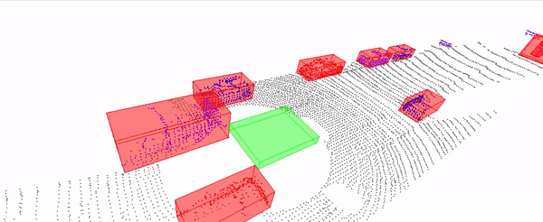

# Lidar-Obstacle Detection

This project implements RANSAC, KD-Tree, and Euclidean clustering algorithms to perceive the an ego car's environment. 

The first thing the above method does is clear any previous rendered point clouds or shapes. Next it loads up your point cloud using your point processor and stream iterator. Then it calls your `cityBlock` function, and updates the iterator. 

If the iterator hits the end of the vector it simply sets it back to the beginning and that's it. The `viewer->spinOnce()` call controls the frame rate, by default it waits 1 time step, which would make it run as fast as possible. 

Depending on how timing efficient your obstacle detection functions were set up the faster the viewer's frame rate will be. If you want to check out the input pcd data at the fastest rate then run the code above and only run a single `renderPointCloud` on the input cloud inside `cityBlock`. Let's check out the results of the streaming pcd viewer below.



## Installation

### Ubuntu 

```bash
$> sudo apt install libpcl-dev
$> cd ~
$> git clone https://github.com/udacity/SFND_Lidar_Obstacle_Detection.git
$> cd SFND_Lidar_Obstacle_Detection
$> mkdir build && cd build
$> cmake ..
$> make
$> ./environment
```

### MAC

#### Install via Homebrew
1. install [homebrew](https://brew.sh/)
2. update homebrew 
	```bash
	$> brew update
	```
3. add  homebrew science [tap](https://docs.brew.sh/Taps) 
	```bash
	$> brew tap brewsci/science
	```
4. view pcl install options
	```bash
	$> brew options pcl
	```
5. install PCL 
	```bash
	$> brew install pcl
	```

#### Build from Source

[PCL Source Github](https://github.com/PointCloudLibrary/pcl)

[PCL Mac Compilation Docs](http://www.pointclouds.org/documentation/tutorials/compiling_pcl_macosx.php)
